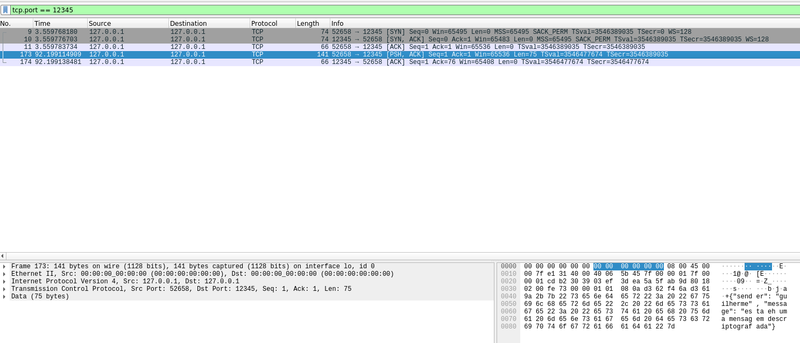
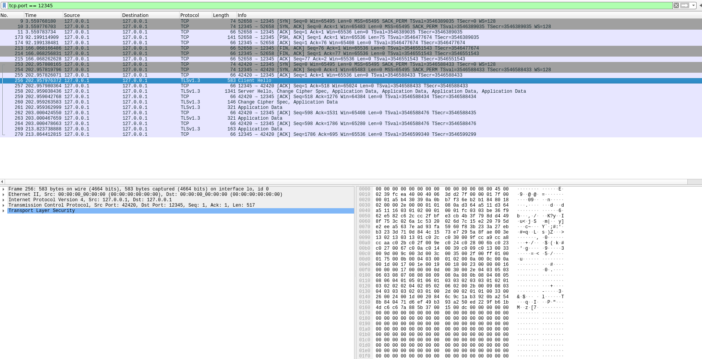
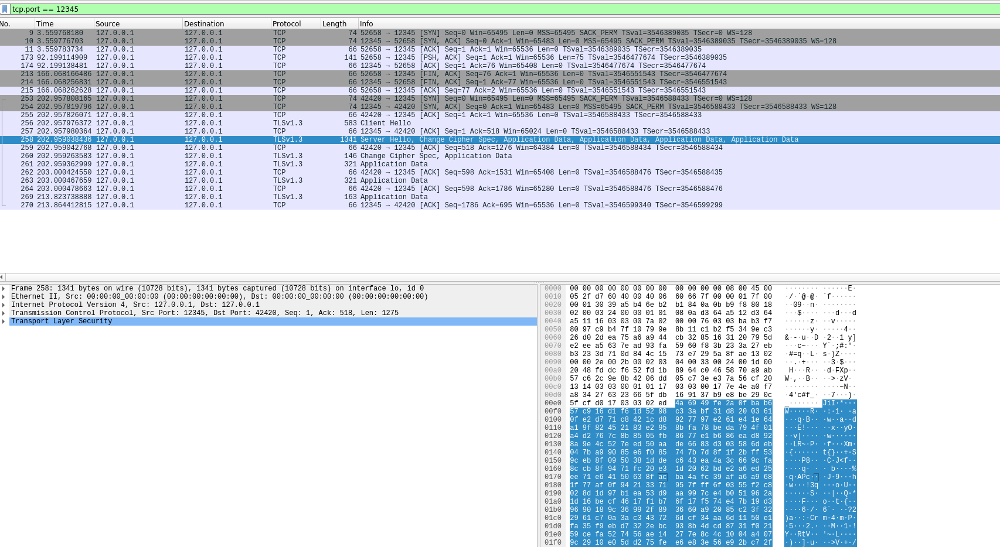

# Chat Server Application

Uma implementação simples de servidor de chat com um socket criptografado, aceitando múltiplos usuários clientes em uma única sala de chat. É permitido que vários usuários tenham o mesmo nome. A criptografia é feita de forma assimétrica, com o servidor tendo posse da chave privada e clientes tendo acesso à um certificado público. Essa aplicação utiliza Python e OpenSSL para demonstrar o processo de criptografia ponta a ponta (do cliente, para servidor e então para o resto dos clientes), de forma a proteger a mensagem em seu tráfego.

## Propriedades de destaque

- **Mensagens em tempo real:** Esse sistema dá suporte a múltiplos clientes conversando em uma única sala concomitantemente.
- **Criptografia Assimétrica:** Utiliza das tecnologias do OpenSSL para criptografar todas as mensagens de ponta a ponta, de forma que somente o servidor tenha acesso à chave de criptografia privada.
- **Servidor Multi-thread:** Cada conexão de um cliente tem sua própria thread para comunicação eficiente.
- **Setup Fácil:** Poucas linhas de comando simples para levantar tanto o servidor quanto clientes.

## Pré-requisitos

- Python 3.9 ou versões posteriores.
- Bibliotecas de python requisitadas:
  - [pyqt6](https://pypi.org/project/PyQt6/) para o design da interface gráfica (GUI).
  - [json](https://docs.python.org/3/library/json.html) para processar as mensagens de envio.
  - [socket](https://docs.python.org/3/library/socket.html) para manipular os sockets.
  - [threading](https://docs.python.org/3/library/threading.html) para manipular as threads de cada cliente.
  - [ssl](https://docs.python.org/3/library/ssl.html) para encapsular os sockets com criptografia.
  - [logging](https://docs.python.org/3/library/logging.html) para fazer o controle do fluxo da aplicação.
  - [argparse](https://docs.python.org/3/library/argparse.html) para permitir argumentos de entrada na linha de código.
- [OpenSSL](https://docs.openiam.com/docs-4.2.1.3/appendix/2-openssl) para a geração das chaves públicas e privadas.
- [libxcb-cursor0](https://packages.debian.org/sid/libxcb-cursor0) instalado na máquina.
### Instalando bibliotecas de python via pip:

```bash
conda create -n "cryptochat" python=3.9.0 -y
conda activate cryptochat
pip install -r path/to/requirements.txt
```

### Instalando OpenSSL via terminal (ubuntu):

Instalando dependências:
```bash
sudo apt-get update && sudo apt-get upgrade
sudo apt install build-essential checkinstall zlib1g-dev -y
```

Instalando o OpenSSL:
```bash
sudo apt install openssl
```

### Instalando libxcb-cursor0 via terminal

```bash
sudo apt install libxcb-cursor0
```

## Uso
Para utilizar esta implementação, é imprescindível primeiro gerar uma chave com OpenSLL para criptografar suas mensagens:

```bash
openssl req -x509 -nodes -days 365 -newkey rsa:2048 -keyout server.key -out server.crt -config server.cnf -extensions v3_req
```

O segundo passo é levantar o servidor de chat:

```bash
python3 servidor.py [ -ip IP_HOST ] [ -p PORTA ]
```

Argumentos do programa:
- IP_HOST: O endereço IP onde o servidor será hospedado. Se nenhum argumento for informado o localhost (127.0.0.1) será usado como padrão.
- PORTA: A porta que será utilizada pelo socket. Se nenhuma porta for especificada a porta 12345 será utilizada como padrão.

Por fim, deve-se executar a quantidade de clientes desejada para acessar o servidor de chat:

```bash
python3 cliente.py [ -ip IP_HOST ] [ -p PORTA ]
```

Os argumentos do cliente seguem o mesmo padrão especificado do servidor e devem ser idênticos ao do servidor levantado para que o cliente acesse corretamente o serviço. Caso o cliente tente acessar um IP e/ou uma porta não utilizados por um servidor, a aplicação resultará em erro.

## Visão Geral do Código

  ### Servidor
  Do ponto de vista do servidor, sua tarefa é garantir a conexão e comunicação segura de vários clientes. Para isso, ele cria um contexto de criptografia usando a biblioteca SSL e as chaves criadas anteriormente. Essa corrente de certificados é usada para encapsular o socket que será usado para cada nova conexão com usuários clientes. Para cada novo cliente, o servidor também fornece uma thread única para comunicação rápida e eficiente.

  ```python
  import ssl
  import socket
  import threading

  try:
      # Cria um contexto SSL para o servidor
      context = ssl.create_default_context(ssl.Purpose.CLIENT_AUTH)
      context.load_cert_chain(certfile='server.crt', keyfile='server.key')

      # Cria o socket TCP
      bindsocket = socket.socket(socket.AF_INET, socket.SOCK_STREAM)
      bindsocket.bind((host, port))
      bindsocket.listen(5)
      logger.info(f"Servidor rodando em {host}:{port}")
  except Exception as error:
      logger.error(f"Servidor encontrou um erro ao tentar levantar um socket: {error}")
      return
  
  print(f"Servidor rodando em {host}:{port}")

  # Loop principal para aceitar conexões com novos usuários clientes
  while True:
      newsocket, fromaddr = bindsocket.accept()
      try:
          # Envolvendo o socket com SSL para criptografia
          connstream = context.wrap_socket(newsocket, server_side=True)
      except ssl.SSLError as error:
          logger.error(f"Erro na conexão SSL: {error}")
          continue
      
      # Cria uma thread para tratar cada cliente de forma paralela
      thread = threading.Thread(target=handle_client, args=(connstream, fromaddr))
      thread.daemon = True
      thread.start()
  ```

  Cada thread será tratada usando a função handle_client, que será responsável por receber suas mensagens individualmente e, então, distribuí-la via broadcast para o restante dos clientes conectados ao servidor.

  ```python
  # Lista global para armazenar as conexões ativas
  clientes = []
  # Lock para sincronizar o acesso à lista de clientes
  clientes_lock = threading.Lock()

  def handle_client(conn, addr):
    logger.info(f"[{addr}] Conexão estabelecida.")
    # Adiciona a conexão à lista de clientes
    with clientes_lock:
        clientes.append((conn, addr))
    try:
        while True:
            data = conn.recv(1024)
            if not data:
                break
            mensagem = data.decode('utf-8')
            loaded_message = json.loads(mensagem)
            texto = loaded_message["message"]
            user = loaded_message["sender"]
            logger.info(f"[{addr}] Mensagem recebida de '{user}': {texto}")
            # Envia a mensagem para todos os outros clientes
            broadcast(data, conn)
    except Exception as error:
        logger.error(f"[{addr}] Erro: {error}")
    finally:
        # Remove a conexão da lista de clientes ao desconectar
        with clientes_lock:
            clientes.remove((conn, addr))
        conn.close()
        logger.info(f"[{addr}] Conexão encerrada.")
  ```

  ### Cliente

  Do ponto de vista do cliente, ele deseja somente estabelecer uma conexão segura com o servidor para enviar e receber mensagens. Para isso, ele usa o certificado (ou chave) público para autenticar sua conexão. Uma vez que o certificado é autenticado, o cliente estabelece uma conexão com o socket criptografado na porta do endereço ip especificado.

  ```python
  try:
      # Cria um contexto SSL para o cliente
      context = ssl.create_default_context(cafile="server.crt")
      # Para testes, desabilitamos a verificação do certificado e hostname
      context.check_hostname = False
      context.verify_mode = ssl.CERT_REQUIRED

      raw_socket = socket.socket(socket.AF_INET, socket.SOCK_STREAM)
      conn = context.wrap_socket(raw_socket, server_hostname=host)
      conn.connect((host, port))
      logger.info("Conectado ao servidor com SSL.")
  except Exception as error:
      logger.error(f"Erro ao se conectar com o servidor! Error: {error}")
      raise(error)
  ```
  Uma vez que a conexão é estabelecida, o cliente cria a interface gráfica usando a classe ChatWindow, que herda da classe abstrata QMainWindow do pacote PyQt6. As funções de tratamento da thread desse usuário estão diretamente ligadas à classe da interface gráfica, de modo que a saída (mensagens enviadas e recebidas) e a entrada (mensagens enviadas) serão exibidas nesta interface.

  ``` python
    window = ChatWindow(username,conn)
    # Thread para receber mensagens continuamente
    thread_recebedor = threading.Thread(target=window.receive_message, args=(conn,))
    thread_recebedor.daemon = True
    thread_recebedor.start()
  ```
  Para permitir que cada cliente saiba quem é o autor de cada mensagem recebida, todas as mensagens consistem em um dicionário python contendo 2 campos: autor e conteúdo. Para enviar este dicionário como uma única stream é necessário processá-lo com a biblioteca json, por exemplo. Essa especifidade também deve ser tratada no recebimento das mensagens, como mostra os métodos da classe ChatWindow de recebimento e envio de mensagens.

  ```python
  def send_message(self):
      # método da classe GUI que trata o envio de mensagens ao servidor
      message = self.message_input.text().strip()
      if message:
          # Adiciona a mensagem escrita no histórico de mensagens e limpa a caixa de texto de entrada
          self.add_message("send",self.username, message)
          self.message_input.clear()
          
          # Toda mensagem a ser enviada para o servidor de chat é encapsulada em um dicionário e processada pela biblioteca json
          # Dessa forma, cada mensagem estará associada à um nome de usuário.
          message_dictionary = {"sender": self.username, "message" : message}
          json_message = json.dumps(message_dictionary)
          try:
              self.conn.send(json_message.encode('utf-8'))
              logger.info(f"Usuario '{self.username}' enviou mensagem com sucesso: '{message}'")
          except Exception as error:
              logger.error(f"Usuario '{self.username}' teve erro ao enviar mensagem: {error}")
  
  def receive_message(self,received_conn): 
      # método da classe GUI que trata o recebimento de mensagens de qualquer outro cliente conectado ao servidor
      try:
          while True:
              data = received_conn.recv(1024)
              if not data:
                  break
              data_dictionary = json.loads(data.decode('utf-8'))
              sender = data_dictionary["sender"]
              message = data_dictionary["message"]
              self.add_message("receive",sender, message)
              logger.info(f"Usuario '{self.username}' recebeu uma mensagem com sucesso: '{message}'")

      except Exception as error:
          logger.error(f"Usuario '{self.username}' teve erro ao receber mensagens:{error}")
      finally:
          received_conn.close()
  ```

## Considerações de Segurança
  Este servidor de chat usa criptografia assimétrica, onde o servidor tem posse da chave privada e cada cliente novo deve usar o certificado (ou chave) pública para se conectar ao serviço. Isso garante a criptografia de ponta à ponta.
  Testes foram feitos com o programa WireShark capturando os pacotes sendo recebidos e enviados pela aplicação com e sem a criptografia.

  Na imagem exemplo à seguir está a captura da aplicação sem nenhuma camada de criptografia. É possível ver o conteúdo das mensagens sendo transmitidas no chat.
  <p align="center">
    
  </p>

  Nas próximas 2 imagens vemos o "handshake" ou "hello" que o cliente e o servidor fazer ao estabelecer uma conexão segura com criptografia. À partir deste "hello" não é mais possível identificar qualquer mensagem sendo transmitida pelo chat por fontes externas. Este sistema, entretanto, ainda é vulnerável à ataques de Man In The Middle.

  <p align="center">
    
  </p>

  <p align="center">
    
  </p>

## Possiveis Melhorias
  - O servidor é vulnerável à ataques de Man In the Middle por conta da criptografia assimétrica sem verificação de host. Uma possível melhora seria implementar uma criptografia simétrica com verificação de host, possívelmente mudando a forma como a CA é gerada.
  - Tratar usuários com nomes iguais, de forma que seja possível diferenciar usuários com mesmo nome em uma conversa.
  - Aprimorar a interface gráfica.
  - Permitir o envio de outros tipos de mensagem além da de texto, como arquivos e imagens.
